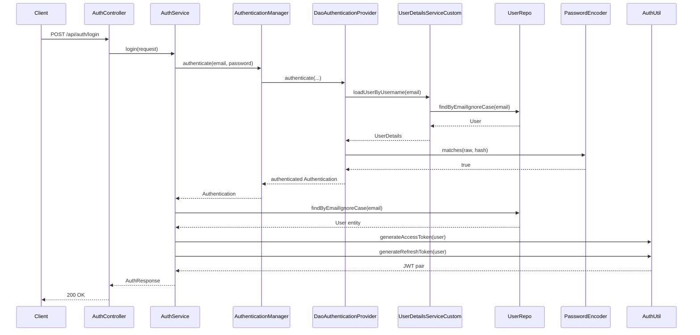
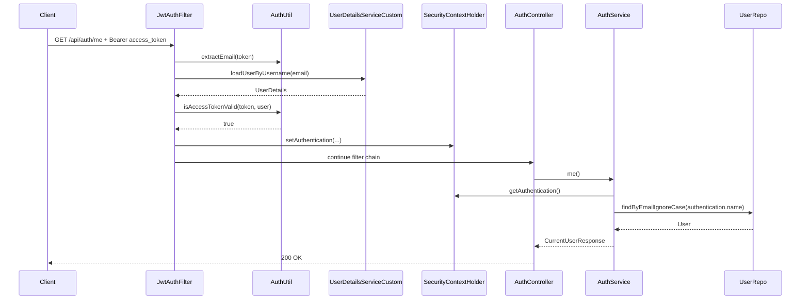

# Spring Security Authentication Flow

Tài liệu này mô tả flow authentication/authorization hiện đang chạy trong dự án, dựa trên code thực tế ở các class:

- `src/main/java/shop/shop/config/SecurityConfig.java`
- `src/main/java/shop/shop/config/ApplicationConfig.java`
- `src/main/java/shop/shop/security/JwtAuthFilter.java`
- `src/main/java/shop/shop/security/UserDetailsServiceCustom.java`
- `src/main/java/shop/shop/security/AuthUtil.java`
- `src/main/java/shop/shop/auth/service/AuthService.java`
- `src/main/java/shop/shop/auth/controller/AuthController.java`
- `src/main/java/shop/shop/user/entity/User.java`

## 1. Thành phần chính

### 1.1 SecurityFilterChain

`SecurityConfig` tạo ra `SecurityFilterChain` và cấu hình:

- `csrf().disable()`
- `cors(Customizer.withDefaults())`
- `SessionCreationPolicy.STATELESS`
- gắn `authenticationProvider(authenticationProvider)`
- gắn `jwtAuthFilter` trước `UsernamePasswordAuthenticationFilter`
- public endpoints:
  - `/api/auth/login`
  - `/api/auth/signup`
  - `/api/auth/refresh-token`
- mọi endpoint còn lại: `authenticated()`

Ý nghĩa: hệ thống không dùng session server-side, mọi request bảo vệ sẽ dựa vào JWT.

### 1.2 AuthenticationManager

`ApplicationConfig` expose bean:

- `AuthenticationManager`
- `AuthenticationProvider`
- `PasswordEncoder`

`AuthenticationManager` được lấy từ `AuthenticationConfiguration`, và khi authenticate sẽ dùng `AuthenticationProvider` đã đăng ký trong `SecurityConfig`.

### 1.3 AuthenticationProvider

Bean `authenticationProvider(...)` trong `ApplicationConfig` tạo `DaoAuthenticationProvider`:

- `UserDetailsServiceCustom` để load user
- `BCryptPasswordEncoder` để check password

Đây là mắt xích chính trong flow login username/password.

### 1.4 UserDetailsServiceCustom

`UserDetailsServiceCustom` implement `UserDetailsService`:

- nhận `email`
- normalize về `trim().toLowerCase()`
- query DB qua `UserRepo.findByEmailIgnoreCase(...)`
- map `User` entity thành `org.springframework.security.core.userdetails.User`

Kết quả trả về chứa:

- `username = email`
- `password = password hash`
- `authorities = user.getAuthorities()`
- `accountLocked = user.isLocked()`

### 1.5 JwtAuthFilter

`JwtAuthFilter` là filter chạy trên mỗi request, trừ:

- `OPTIONS`
- `/api/auth/login`
- `/api/auth/signup`
- `/api/auth/refresh-token`

Nhiệm vụ:

- đọc header `Authorization`
- lấy Bearer token
- extract email từ JWT
- load `UserDetails`
- validate access token
- nếu hợp lệ thì set `Authentication` vào `SecurityContextHolder`

### 1.6 AuthUtil

`AuthUtil` chịu trách nhiệm:

- generate access token
- generate refresh token
- parse JWT
- extract `email`
- kiểm tra token type: `access` hoặc `refresh`
- kiểm tra expiration

Claims hiện đang nhúng trong JWT:

- `userId`
- `role`
- `fullName`
- `tokenType`

## 2. Flow khởi tạo authentication bean

Flow khởi tạo từ Spring context:

1. Spring tạo `PasswordEncoder` là `BCryptPasswordEncoder`.
2. Spring tạo `DaoAuthenticationProvider`.
3. `DaoAuthenticationProvider` được gắn:
   - `UserDetailsServiceCustom`
   - `PasswordEncoder`
4. Spring tạo `AuthenticationManager` từ `AuthenticationConfiguration`.
5. `SecurityConfig` inject `AuthenticationProvider` và `JwtAuthFilter` vào `SecurityFilterChain`.

Tóm gọn:

```text
AuthenticationManager
    -> DaoAuthenticationProvider
        -> UserDetailsServiceCustom
            -> UserRepo

DaoAuthenticationProvider
    -> PasswordEncoder(BCryptPasswordEncoder)
```

## 3. Flow login: `/api/auth/login`

Đây là flow authenticate bằng email/password.

### 3.1 Request đi vào controller

Client gọi:

```http
POST /api/auth/login
Content-Type: application/json

{
  "email": "user@example.com",
  "password": "123456"
}
```

`AuthController.login()` gọi `authService.login(request)`.

### 3.2 AuthService tạo Authentication token

Trong `AuthService.login()`:

1. normalize email
2. tạo `UsernamePasswordAuthenticationToken(email, password)`
3. gọi `authenticationManager.authenticate(...)`

Đây là điểm bắt đầu flow Spring Security chuẩn.

### 3.3 AuthenticationManager gọi AuthenticationProvider

`AuthenticationManager` delegate cho `DaoAuthenticationProvider`.

`DaoAuthenticationProvider` làm các bước:

1. gọi `UserDetailsServiceCustom.loadUserByUsername(email)`
2. `UserDetailsServiceCustom` query `UserRepo`
3. trả về `UserDetails`
4. `DaoAuthenticationProvider` dùng `BCryptPasswordEncoder` để so password raw với password hash trong DB
5. nếu đúng thì trả về `Authentication` đã authenticated
6. nếu sai thì ném `BadCredentialsException`

### 3.4 AuthService generate JWT

Sau khi authenticate thành công:

1. `AuthService` lấy `UserDetails` từ `authentication.getPrincipal()`
2. query lại `User` entity từ DB bằng email
3. gọi:
   - `authUtil.generateAccessToken(user)`
   - `authUtil.generateRefreshToken(user)`
4. build `AuthResponse`
5. trả `ApiResponse.success(...)`

Lưu ý:

- login không set `SecurityContextHolder` thủ công trong service
- login trả token về client để client dùng cho request sau

### 3.5 Sơ đồ login



## 4. Flow request đã đăng nhập: JWT authenticate mỗi request

Ví dụ client gọi:

```http
GET /api/auth/me
Authorization: Bearer <access_token>
```

### 4.1 JwtAuthFilter chạy trước controller

Vì `/api/auth/me` không nằm trong public endpoints nên request đi qua `JwtAuthFilter`.

Filter làm các bước:

1. đọc `Authorization`
2. nếu không có header hoặc không bắt đầu bằng `Bearer `:
   - bỏ qua
   - cho request đi tiếp
3. nếu có token:
   - `authUtil.extractEmail(token)`
   - kiểm tra `SecurityContext` chưa có auth
   - `userDetailsService.loadUserByUsername(email)`
   - `authUtil.isAccessTokenValid(token, user)`
4. nếu token hợp lệ:
   - tạo `UsernamePasswordAuthenticationToken(user, null, authorities)`
   - set details từ request
   - `SecurityContextHolder.getContext().setAuthentication(auth)`

### 4.2 Sau filter, Spring authorize request

Sau khi filter set `Authentication`, phần authorize của Spring Security kiểm tra:

- request có authenticated chưa
- có bị chặn quyền hay không

Nếu không có auth hợp lệ:

- protected endpoint sẽ trả `401 Unauthorized`

Nếu có auth nhưng thiếu quyền:

- trả `403 Forbidden`

### 4.3 Controller/service đọc user hiện tại

Trong `AuthService.me()`:

1. lấy `Authentication` từ `SecurityContextHolder`
2. kiểm tra:
   - auth khác null
   - `isAuthenticated() = true`
   - không phải `AnonymousAuthenticationToken`
3. lấy `authentication.getName()` => email
4. query `User` từ DB
5. trả `CurrentUserResponse`

### 4.4 Sơ đồ request protected



## 5. Flow refresh token: `/api/auth/refresh-token`

Endpoint này là public endpoint, nên:

- không cần access token hợp lệ
- `JwtAuthFilter` bỏ qua endpoint này

Flow trong `AuthService.refreshAccessToken(...)`:

1. lấy header `Authorization`
2. extract Bearer refresh token
3. `authUtil.extractEmail(refreshToken)`
4. query user từ DB
5. `authUtil.isRefreshTokenValid(refreshToken, user)`
6. nếu hợp lệ:
   - generate access token mới
   - trả `RefreshTokenResponse`

Lưu ý:

- refresh token hiện không bị lưu DB
- hệ thống đang validate refresh token theo chữ ký, `tokenType=refresh`, email và expiration
- endpoint này không rotate refresh token, chỉ cấp `access token` mới

## 6. Flow signup: `/api/auth/signup`

Flow đăng ký trong `AuthService.signup(...)`:

1. normalize email/password/fullName
2. validate input
3. check email đã tồn tại chưa
4. lấy role `USER` từ DB qua `RoleRepository`
5. encode password bằng `BCryptPasswordEncoder`
6. lưu `User`
7. generate access token + refresh token
8. trả `AuthResponse`

`RoleDataInitializer` đảm bảo khi app start sẽ có sẵn:

- `USER`
- `ADMIN`

## 7. Quan hệ giữa các class

```text
AuthController
    -> AuthService

AuthService
    -> AuthenticationManager
    -> AuthUtil
    -> UserRepo
    -> RoleRepository
    -> PasswordEncoder

AuthenticationManager
    -> DaoAuthenticationProvider

DaoAuthenticationProvider
    -> UserDetailsServiceCustom
    -> PasswordEncoder

JwtAuthFilter
    -> AuthUtil
    -> UserDetailsServiceCustom

UserDetailsServiceCustom
    -> UserRepo
```

## 8. Response khi lỗi

Nguồn lỗi auth trong dự án hiện tại đi theo 2 nhánh:

### 8.1 Lỗi tại SecurityFilterChain

Trong `SecurityConfig`:

- chưa authenticate mà vào protected endpoint => `401`
- authenticated nhưng không đủ quyền => `403`

Response được ghi trực tiếp ra JSON.

### 8.2 Lỗi trong service/provider

`GlobalExceptionHandler` xử lý:

- `BadCredentialsException` => `401`
- `UsernameNotFoundException` => `401`
- `AuthenticationException` => `401`
- `AccessDeniedException` => `403`
- `IllegalArgumentException` => `400`
- `IllegalStateException` => `400`

## 9. Điểm cần nhớ khi đọc flow này

1. Login dùng `AuthenticationManager -> DaoAuthenticationProvider -> UserDetailsServiceCustom -> PasswordEncoder`.
2. Các request sau login không đi qua `AuthenticationManager` nữa, mà đi qua `JwtAuthFilter`.
3. `JwtAuthFilter` chỉ xác thực access token, không xử lý refresh token.
4. `refresh-token` là public endpoint, tự validate refresh token trong `AuthService`.
5. Hệ thống đang chạy stateless hoàn toàn, không dùng session.
6. Role trong DB đang được normalize về `USER`, `ADMIN`; khi convert sang authority thì entity tự thêm prefix `ROLE_`.

## 10. Tóm tắt ngắn nhất

```text
LOGIN
Client -> AuthController -> AuthService
-> AuthenticationManager
-> DaoAuthenticationProvider
-> UserDetailsServiceCustom
-> UserRepo
-> PasswordEncoder
-> success
-> AuthUtil generate access token + refresh token
-> trả token cho client

REQUEST SAU LOGIN
Client -> JwtAuthFilter
-> AuthUtil parse access token
-> UserDetailsServiceCustom load user
-> validate token
-> set SecurityContext
-> controller/service xử lý request

REFRESH TOKEN
Client -> AuthController -> AuthService
-> extract refresh token
-> AuthUtil validate refresh token
-> generate access token mới
```
